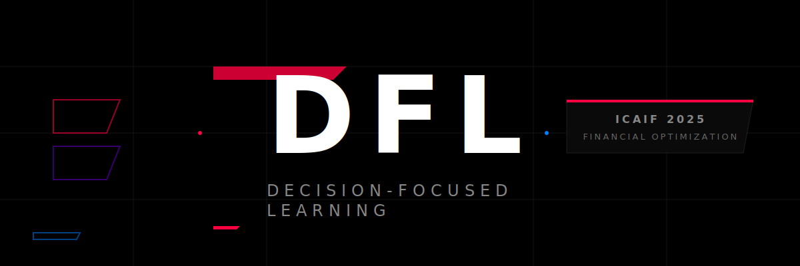
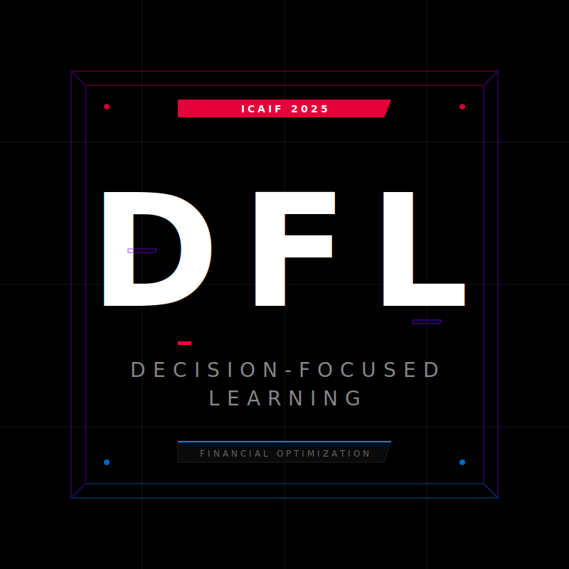

  
   
   

# Decision-Focused Learning in Financial Optimization

**Official repository for the Decision-Focused Learning tutorial at [ICAIF 2025](https://icaif25.org/)**

[🌐 Website](https://bridge-po.github.io/) • [📖 Documentation](#) • [💻 Notebooks](https://github.com/Bridge-PO/ICAIF_25/tree/main/Code)

---

## 📋 Overview

This tutorial introduces **Decision-Focused Learning (DFL)** and its applications to financial optimization problems. Unlike traditional prediction-focused approaches, DFL directly aligns machine learning training objectives with the quality of downstream decisions, leading to superior performance in portfolio optimization and financial decision-making tasks.

**📅 Date:** Saturday, November 15, 2025  
**⏰ Time:** 2:00 PM - 5:30 PM SGT  
**📍 Location:** Singapore  
**🎯 Duration:** 3.5 hours  

## 🎓 What You'll Learn

- Fundamental differences between Prediction-Focused Learning (PFL) and Decision-Focused Learning (DFL)
- How to implement end-to-end differentiable optimization with PyTorch and cvxpylayers
- Applications of DFL to Mean-Variance Optimization and Portfolio Management
- Techniques for partial index tracking with DFL
- Practical hands-on experience with real financial datasets

## 📚 Tutorial Schedule

| Session | Title | Speaker |
|---------|-------|---------|
| **1** | Introduction & Motivation | Yongjae Lee (UNIST) |
| **2** | Background in Decision-Focused Learning | Haeun Jeon (KAIST) |
| **3** | DFL in Mean-Variance Optimization | Junhyeong Lee (UNIST) |
| **4** | DFL in Partial Index Tracking | Hyunglip Bae (KAIST) |
| **5** | Closing Remarks & Future Directions | Yongjae Lee (UNIST) |

## 🔬 Key Concepts

### Prediction-Focused Learning (PFL)
Traditional two-stage approach:
1. Train ML model to predict parameters (e.g., returns, covariance)
2. Use predictions as input to optimization problem

**Problem:** Optimizing prediction accuracy doesn't necessarily optimize decision quality.

### Decision-Focused Learning (DFL)
End-to-end approach:
1. Integrate prediction and optimization into single differentiable pipeline
2. Train ML model to directly optimize decision quality
3. Gradients flow from decision loss back through optimization to predictions

**Advantage:** Learns predictions that lead to better decisions, not just accurate predictions.

## 📧 Contact

For questions or issues, please:
- Open an issue on GitHub
- Email: jun.lee@unist.ac.kr

## 📜 License

This project is licensed under the MIT License

## 🙏 Acknowledgments

- ICAIF 2025 organizing committee
- UNIST and KAIST research teams
- Open source community for PyTorch, cvxpy, and cvxpylayers

## 🔗 Resources

- **Tutorial Website:** [https://bridge-po.github.io/](https://bridge-po.github.io/)
- **ICAIF 2025:** [https://icaif25.org/](https://icaif25.org/)
- **cvxpylayers Documentation:** [https://github.com/cvxgrp/cvxpylayers](https://github.com/cvxgrp/cvxpylayers)
- **PyTorch Documentation:** [https://pytorch.org/docs/](https://pytorch.org/docs/)

---

**⭐ If you find this tutorial helpful, please star this repository!**

© 2025 DFL @ ICAIF'25 • UNIST & KAIST

